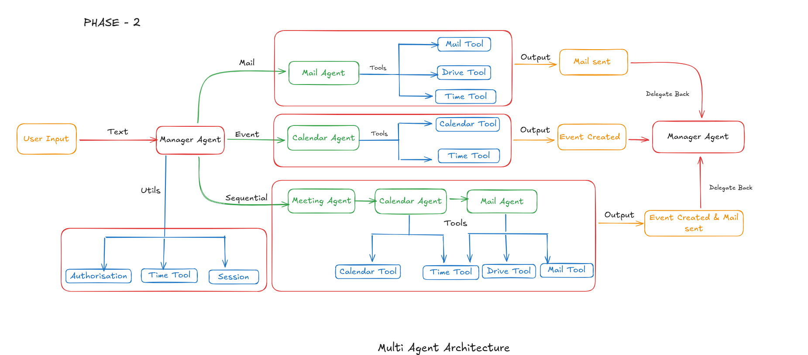

# Multi-Agent Mail & Calendar Assistant

## Overview
This project is a beginner-friendly multi-agent system that can send emails and manage calendar events using a controlled, human-in-the-loop workflow.  
The system is designed to avoid unsafe automation by always asking for user confirmation before performing critical actions like sending emails or creating calendar events.

The project is built as part of an internship learning exercise, focusing on system design, agent coordination, and real-world authentication using Google OAuth.

---

## Key Features
- Manager agent to control overall flow  
- Mail agent to generate email drafts  
- Calendar agent to create events after email confirmation  
- Google Drive integration for attaching files  
- Human-in-the-loop confirmation before sending emails  
- Session-based memory (no database used)  
- Real Gmail integration using OAuth 2.0  
- Modular and beginner-friendly code structure  

---

## How It Works (High Level)
1. User provides an input request  
2. Intent is classified by the system  
3. If the request is actionable:
   - An email draft is generated  
   - The draft is shown to the user  
4. Email is sent only after explicit user confirmation  
5. Calendar event is created only after the email is successfully sent  
6. All actions are tracked using in-memory session state  

---

## Authentication
- Gmail access is handled using Google OAuth 2.0  
- Authentication tokens are stored locally (`token.json`)  
- No credentials or tokens are committed to GitHub  
- Only minimal scopes are requested for safety  

---

## Project Structure

```text
multi_agent_assistant/
│
├── app.py
├── agents/
│   ├── manager_agent.py
│   ├── mail_agent.py
│   ├── calendar_agent.py
│   └── intent_router_agent.py
│
├── tools/
│   ├── auth_manager.py
│   ├── email_tool.py
│   └── gdrive_tool.py
│
├── session/
│   └── session_state.py
│
├── README.md
├── .gitignore

```

## Flow Diagram 


---

## How to Run (High Level)
1. Create and activate a virtual environment  
2. Install required dependencies  
3. Add `credentials.json` from Google Cloud Console  
4. Run the application using `python app.py`  
5. Follow on-screen prompts  

---

## Notes
- This project is under active development  
- Calendar, Drive, and Gemini integrations are added incrementally  
- The focus is on learning correct system design, not rapid automation  
